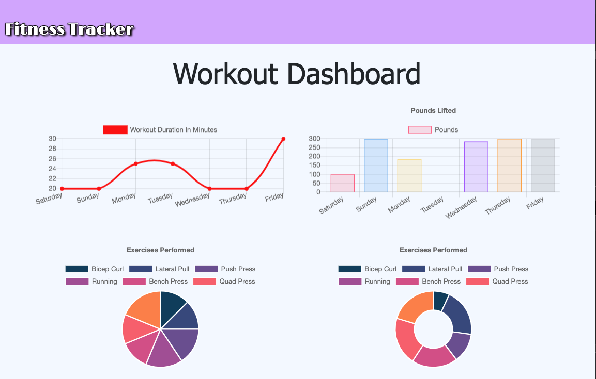

# Move_Those_Buns

[](https://opensource.org/licenses/MIT)

## Description

This is a fitness tracker that allows a user to create and track daily workouts with the option to **Continue Workout** or create **New Workout**. User will be able to track the `name, type, weight, sets, reps, and duration` of the exercise. And if the exercise chosen is a **cardio** exercise, the user is able to track the `distance` completed during the workout. The user will be able to view the combined weight of multiple exercises from the past week of workouts as well as view the duration of each workout.

:round_pushpin: [Click here to navigate to deployed app on Heroku!](https://move-those-buns.herokuapp.com/) :round_pushpin:

## Table of Contents

- [Demonstration](#demonstration)
- [Features](#features)
- [Installation](#installation)
- [Usage](#usage)
- [License](#license)
- [Contribution](#contribution)
- [Technologies](#technologies)
- [Contact Information](#contact-information)

## Demonstration
### Home Page


### Cardio Menu


### Resistance Menu


### Stats Page


## Features

- The `models` folder houses the two javascript files:
  - `index.js` code to connect node to MySQL.
  - `Workout.js` which contains the methods used in order to retrieve and store data in the database.
- The public folder contains the css and images files that represent the front-end.
- The `seeders` folder contains the mongodb files including:
  - `seed.js` which contain the mongodb queries.
  - 

### Directory Structure

```
├── models
│   └── index.js
│   └── Workout.js
│ 
├── node_modules
│
├── public
│   └── assets
│       ├── css
│       │  └── style.css
│       └── img
│           └── cardio.png
│           └── graphs.png
│           └── main.png
│           └── resistance.png
│           └── rich.jpg
│       └── js
│           └── api.js
│           └── exercise.js
│           └── index.js
│           └── stats.js
│           └── workout.js 
│   └── exercise.html
│   └── index.html
│   └── stats.html
│
├── routes
│   └── api-routes.js
│   └── html-routes.js
│
├── seeders
│   └── seed.js
│
├── package-lock.json
├── package.json  
│
├── server.js
```

## Installation

This application is deployed through Heroku for immediate use.

However; if a user desires to work on this locally, they may clone this repository and the following dependencies are required to be installed for this application to run properly:

      npm i
      npm install express
      npm install mongoose
      npm install morgan
      npm install dotenv

## Usage

Once all packages have been installed, users should run the following command in the terminal:

     `node server.js`

This command and will instruct the app to begin listening on the `LocalHost: PORT`. This will then instruct users to either `Cmd + Click` for Mac users or `Ctrl + Click` on Windows which will open the browser with the following address or to enter the following in the web browser to deploy the application locally.

    `localhost:8080`.


## License

[](https://opensource.org/licenses/MIT)

This application is licensed under the MIT License.

## Contribution

This project was creating with help from:

- Provided material from: BootCamp Spot class
- My tutor [Eric Wallen](https://github.com/ericwallen)
- Help from other students in the class in a private study group.


## Technologies

- [Node.js](https://nodejs.org/en/)
- [Express.js](https://expressjs.com/)
- [MongoDB](https://www.mongodb.com/)
- [Mongoose](https://mongoosejs.com/docs/)
- [Dotenv](https://www.npmjs.com/package/dotenv)
- [Heroku](https://devcenter.heroku.com/articles/getting-started-with-nodejs)
- [Visual Studio Code](https://code.visualstudio.com/)
- Terminal / Git Bash

## Contact Information

- GitHub: [nsc9605](https://github.com/nsc9605)
- Portfolio: [Deploy Portfolio](https://nsc9605.github.io/Responsive-Portfolio/)
- Email: [Nicole Catapano](mailto:nsc9605@gmail.com)
